# 👋 Hi, I’m Erick Silva

  

    I’m a passionate **Junior Front-End Developer** focused on building intuitive and functional user interfaces. I’m actively looking for opportunities to grow and contribute to challenging projects.

    I have hands-on experience with **JavaScript**, **Vue.js**, **HTML**, **CSS**, and I’m always learning new technologies to deliver clean, efficient, and maintainable code.
  

  

    
  

---

# 💻 Tech Stack:
               

---

<!-- resto do README -->
